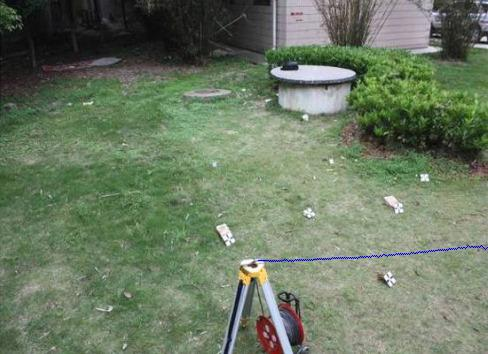
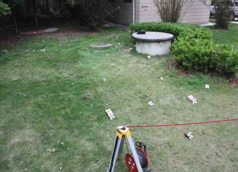
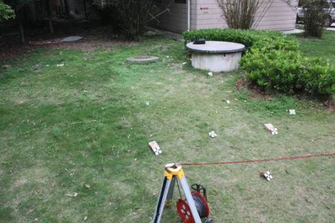
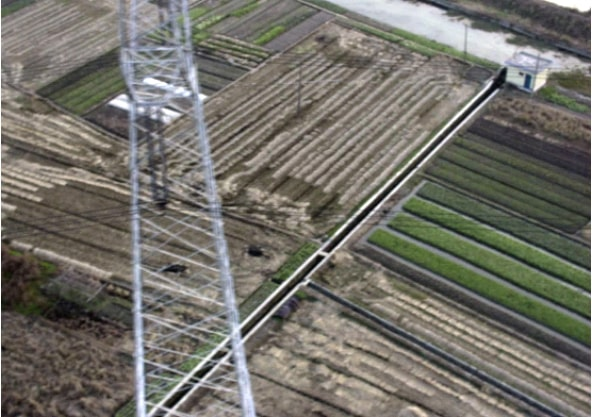
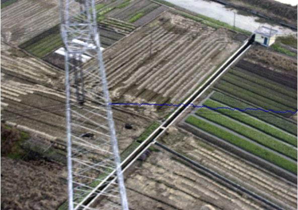
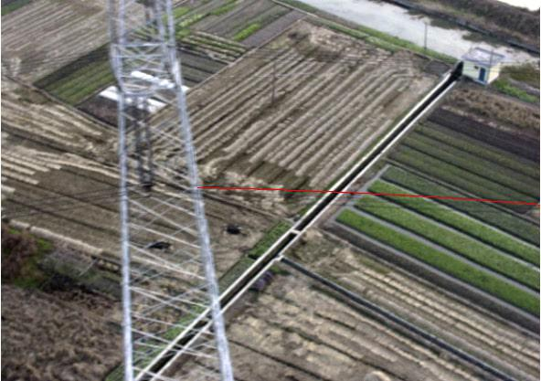
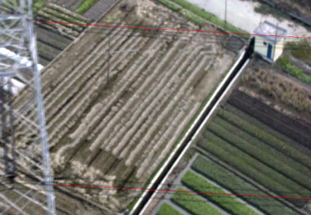
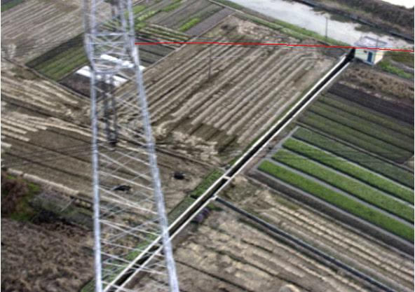

# Line Tracing Algorithm 

This is a Photogrammetric technique for detection line in the image.

**Original paper:**  

X. Wan, X. Qu, L. Wang, B. Wu, J. Zhang, and S. Zheng, “Photogrammetric techniques for power line ranging,” Pattern Recognition Letters, 2010

## The proposed method in the paper: 

* The extraction of the power line is based on the significant difference in the gray value of the current point is 
similar to the previous one. Due to the angle of the camera, the author proposed 3 directions of gradients: 0 degree, 
45 degree and -45 degree. 

with: 

This part you can see at my repo "Image Gradients".

Then trace along the direction with the smallest gradient among them. Then continue to search the next point with the 
same rule until search at the boundary of the image.

* During searching, they also proposed the **Searching Direction Constrain**, this part currently I don't understand. I'll 
read some mathematics to figure out their concept and then implement it later, this also affect my current result. You
can see the different at the experiment part.
* After tracing all the interest points, they use **Curve Fitting**. The purpose of curve fitting is twofold: firstly, it
can remove errors to some degrees, thus provides a validity check for the extraction of powerline point and secondly, it 
allows for modeling the power line description as linear feature. The power line in their condition is treated as curve line, 
so a conic polynomial is appropriate for the curve fitting.

## Experiment results

This is my result: 

And the author's result:

* In my result, you can see the effect of applying curve fitting on the predicted line to smooth the line. The RGB image 
with blue color and red color respectively. 

* In the author's result, you can see the affect of applying the **Searching Direction Constrain**, compared with my result. 

## Update Result 22/09

Added the **Searching Direction Constrain**. Comparing my result with the author's result. 

| Original Image      | My result - detected line | My result - curve refined line (output)| Author's result|
| ----------- | ----------- |------|------|
| ||||
| | |||
| | |||

Finally, I understand the concept of the proposed **Line Tracing Algorithm**

## TODO:
- [x] Implement the **Searching Direction Constrain** and compare my result with the author's result.  
- [ ] Refactor the line_tracing function to more flexible when change the gradient directions, this can be done when I
define the array contains directions unit w.r.t each direction and choose them by their index. Ok, I'll implement it
tomorrow. 
- [ ] Apply more gradients orient and track lines on my sample data.
- [ ] Refine the code.
